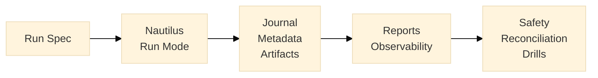

# Architecture (Logical)

This document describes the logical architecture only.
Implementation structure, module internals, and package naming are deferred to future work.
For the runnable local demo flow, see [Demo Flow](demo-flow.md).

## Diagram

## Responsibilities

### Run Spec

- Defines mode (`backtest` or `paper`) and run intent
- Captures immutable run inputs (configuration and references)
- Serves as the versioned source of truth for a run
- Includes reserved local-only `connectivity_readiness` metadata for env-placeholder preflight intent

### Nautilus Run Mode

- Executes the run in one of two modes: backtest or paper
- Applies the same operational model across both modes where possible
- Produces run lifecycle events for downstream tracking
- Backtest mode currently executes a Nautilus engine smoke path over prepared 1-minute candles
- Backtest currently registers one built-in local scenario strategy (`ops_smoke_demo`)
- RunSpec `strategy` fields are currently scenario identity metadata, not custom strategy loading

### Journal / Metadata / Artifacts

- Journal records operational run events and notable actions
- Metadata records identifiers, timestamps, status, and hashes
- Artifacts store outputs in a predictable run-oriented layout
- Concrete artifact paths in this repo:
  - `artifacts/runs/<run_id>/run_spec.yaml`
  - `artifacts/runs/<run_id>/metadata.json`
  - `artifacts/runs/<run_id>/journal.jsonl`
  - `artifacts/runs/<run_id>/metrics.json`
  - `artifacts/runs/<run_id>/report.md`
  - `artifacts/runs/<run_id>/connectivity_readiness.json` (when readiness is evaluated)

### Reports / Observability

- Reports summarize run outcomes and key checks
- Observability hooks expose basic signals for health and run progress
- Designed for practical inspection, not full production telemetry
- Readiness metrics are artifact-backed from `connectivity_readiness.json`; they do not perform network probes
- Static dashboard definition: `dashboards/grafana/tradingchassis-ops-lab-run-observability.json`

### Safety / Reconciliation / Drills

- Safety controls include kill switch behavior
- Reconciliation checks detect expected state mismatches
- Failure drills validate operational response for known scenarios
- File-based local outputs:
  - `runtime/kill_switch/<run_id>.state.json`
  - `runtime/kill_switch/<run_id>.events.jsonl`
  - `artifacts/runs/<run_id>/reconciliation_result.json`
  - `artifacts/runs/<run_id>/drills/*.json`
